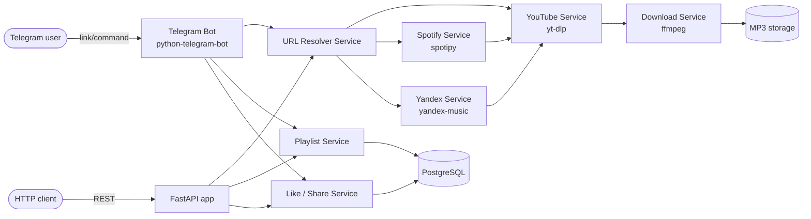

# Tunebot — Multi-Source Music Bot (Plan + Code)

<aside>
⚠️

**Legal notice:** Downloading copyrighted music from YouTube, Spotify, or Yandex Music almost always violates their Terms of Service. Spotify and Yandex Music explicitly prohibit extracting audio. This guide treats Spotify/Yandex links as *metadata sources only* — the actual audio is found and downloaded from YouTube (which still requires respecting copyright). Use for content you legally own or that is freely licensed.

</aside>

## 1. What we're building

A Telegram bot called **Tunebot** with a clean services architecture:

- Paste any link (YouTube, YouTube Music, Spotify, Yandex Music — single track or playlist).
- Bot resolves the link to track metadata, **searches that track on YouTube**, and downloads it as MP3 via `yt-dlp` + `ffmpeg`.
- Telegram's native audio player is the "player". Inline buttons add ▶️ Play / ⏭ Next / ⏮ Prev / ❤️ Like / ➕ Add to playlist / 🔗 Share.
- Per-user **playlists**, **Liked Songs**, and **shareable playlist links** stored in PostgreSQL.
- **FastAPI** web API for the same data (browse/manage from a future web/mobile client).
- Configuration via a single `.env` file (no hard-coded secrets).

## 2. High-level architecture



Key idea: **Spotify/Yandex are metadata only.** Their service returns `{title, artist}` tuples; the YouTube service searches that string, picks the top result, and downloads it.

## 3. Tech stack

| Concern | Choice |
| --- | --- |
| Language | Python 3.12 |
| Bot framework | `python-telegram-bot` 21.x (async) |
| Web API | `FastAPI`  • `uvicorn` |
| DB | PostgreSQL + `SQLAlchemy` 2.x async + `Alembic` |
| Config | `pydantic-settings` reading `.env` |
| Downloader | `yt-dlp`  • `ffmpeg` |
| Spotify metadata | `spotipy` (Client-Credentials flow) |
| Yandex metadata | `yandex-music` |
| Background tasks | `asyncio`  • `arq` (Redis queue) |
| Container | Docker + docker-compose |

## 4. Implementation plan & task list

### Phase 0 — Project scaffold

- [ ]  Initialize repo, `pyproject.toml`, `.gitignore`, `.env.example`, `README.md`.
- [ ]  Set up `app/config.py` with `pydantic-settings` reading `.env`.
- [ ]  Set up logging.
- [ ]  Add `docker-compose.yml` (postgres + redis + bot + api).

### Phase 1 — Database

- [ ]  Define SQLAlchemy models: `User`, `Track`, `Playlist`, `PlaylistTrack`, `Like`, `ShareToken`.
- [ ]  Create async session + engine.
- [ ]  Alembic init + first migration.
- [ ]  Repositories for each entity.

### Phase 2 — Source services

- [ ]  `youtube_service.py`: search + download to MP3 via `yt-dlp`.
- [ ]  `spotify_service.py`: resolve track / playlist links → list of `{title, artist}`.
- [ ]  `yandex_service.py`: resolve track / playlist / album links → list of `{title, artist}`.
- [ ]  `resolver.py`: regex-based dispatcher that picks the right service.

### Phase 3 — Orchestration

- [ ]  `download_service.py`: takes any link → list of `TrackQuery` → downloads each via YouTube → persists `Track` rows.
- [ ]  Cache: skip download if `(title, artist)` already on disk.
- [ ]  Queue long playlists through `arq` workers.

### Phase 4 — Telegram bot

- [ ]  `bot/app.py` builds the `Application` with handlers wired in.
- [ ]  Handlers: `/start`, `/help`, URL handler, `/playlists`, `/liked`, `/share`.
- [ ]  Inline keyboards: player controls, playlist picker.
- [ ]  Callback handlers for play/next/prev/like/add-to-playlist/share.

### Phase 5 — Web API

- [ ]  `api/app.py` FastAPI app.
- [ ]  Routers: `/tracks`, `/playlists`, `/likes`, `/share/{token}`.
- [ ]  Pydantic schemas + dependency-injected DB session.
- [ ]  Auth: simple Telegram-user bearer token (Telegram `initData` verification later).

### Phase 6 — Sharing

- [ ]  Generate short `ShareToken` per playlist.
- [ ]  Public read-only endpoint `/share/{token}` returns playlist JSON.
- [ ]  Telegram deep link `https://t.me/<bot>?start=share_<token>` clones the playlist into the recipient's account.

### Phase 7 — Polish

- [ ]  Rate limiting per user.
- [ ]  Cleanup job for old files.
- [ ]  Unit tests for services, integration tests for handlers.
- [ ]  CI (GitHub Actions): lint + test + build image.

## 5. Final project tree

```
tunebot/
├── .env.example
├── .gitignore
├── pyproject.toml
├── docker-compose.yml
├── Dockerfile
├── alembic.ini
├── alembic/
│   └── versions/
├── storage/
│   └── downloads/
└── app/
    ├── __init__.py
    ├── main.py
    ├── config.py
    ├── logging_config.py
    ├── db/
    │   ├── __init__.py
    │   ├── base.py
    │   ├── session.py
    │   └── models.py
    ├── repositories/
    │   ├── __init__.py
    │   ├── user_repo.py
    │   ├── track_repo.py
    │   ├── playlist_repo.py
    │   └── like_repo.py
    ├── services/
    │   ├── __init__.py
    │   ├── types.py
    │   ├── resolver.py
    │   ├── youtube_service.py
    │   ├── spotify_service.py
    │   ├── yandex_service.py
    │   ├── download_service.py
    │   ├── playlist_service.py
    │   ├── like_service.py
    │   └── share_service.py
    ├── bot/
    │   ├── __init__.py
    │   ├── app.py
    │   ├── keyboards.py
    │   ├── utils.py
    │   └── handlers/
    │       ├── __init__.py
    │       ├── start.py
    │       ├── url.py
    │       ├── playlist.py
    │       ├── liked.py
    │       └── callbacks.py
    └── api/
        ├── __init__.py
        ├── app.py
        ├── deps.py
        ├── schemas.py
        └── routers/
            ├── __init__.py
            ├── tracks.py
            ├── playlists.py
            ├── likes.py
            └── share.py
```

## 6. Configuration files

### `.env.example`

```bash
# Telegram
BOT_TOKEN=123456:ABC-your-telegram-bot-token
BOT_USERNAME=tunebot                 # without @

# Spotify (https://developer.spotify.com/dashboard)
SPOTIFY_CLIENT_ID=
SPOTIFY_CLIENT_SECRET=

# Yandex Music (token from https://github.com/MarshalX/yandex-music-api)
YANDEX_MUSIC_TOKEN=

# Database
DATABASE_URL=postgresql+asyncpg://tunebot:tunebot@db:5432/tunebot

# Redis (used by arq queue)
REDIS_URL=redis://redis:6379/0

# Web API
API_HOST=0.0.0.0
API_PORT=8000
API_PUBLIC_URL=http://localhost:8000

# Storage
DOWNLOAD_DIR=./storage/downloads
MAX_FILESIZE_MB=48
MAX_DURATION_SECONDS=3600

# App
LOG_LEVEL=INFO
```

### `pyproject.toml`

```toml
[project]
name = "tunebot"
version = "0.1.0"
requires-python = ">=3.12"
dependencies = [
    "python-telegram-bot[job-queue]==21.6",
    "yt-dlp>=2024.10.0",
    "mutagen",
    "spotipy>=2.24.0",
    "yandex-music>=2.2.0",
    "fastapi>=0.115",
    "uvicorn[standard]>=0.30",
    "sqlalchemy[asyncio]>=2.0",
    "asyncpg>=0.29",
    "alembic>=1.13",
    "pydantic-settings>=2.5",
    "arq>=0.26",
    "redis>=5.0",
    "python-dotenv>=1.0",
]
```

### `docker-compose.yml`

```yaml
services:
  db:
    image: postgres:16-alpine
    environment:
      POSTGRES_USER: tunebot
      POSTGRES_PASSWORD: tunebot
      POSTGRES_DB: tunebot
    volumes:
      - pgdata:/var/lib/postgresql/data
    ports: ["5432:5432"]

  redis:
    image: redis:7-alpine
    ports: ["6379:6379"]

  bot:
    build: .
    command: python -m app.main bot
    env_file: .env
    depends_on: [db, redis]
    volumes:
      - ./storage:/app/storage

  api:
    build: .
    command: python -m app.main api
    env_file: .env
    ports: ["8000:8000"]
    depends_on: [db]
    volumes:
      - ./storage:/app/storage

  worker:
    build: .
    command: arq app.workers.WorkerSettings
    env_file: .env
    depends_on: [db, redis]
    volumes:
      - ./storage:/app/storage

volumes:
  pgdata:
```

### `Dockerfile`

```docker
FROM python:3.12-slim
RUN apt-get update && apt-get install -y --no-install-recommends ffmpeg \
    && rm -rf /var/lib/apt/lists/*
WORKDIR /app
COPY pyproject.toml .
RUN pip install --no-cache-dir .
COPY . .
ENV PYTHONUNBUFFERED=1
CMD ["python", "-m", "app.main", "bot"]
```

## 7. Core application code

### `app/config.py`

```python
from pathlib import Path
from pydantic import Field
from pydantic_settings import BaseSettings, SettingsConfigDict

class Settings(BaseSettings):
    model_config = SettingsConfigDict(env_file=".env", extra="ignore")

    # Telegram
    bot_token: str
    bot_username: str

    # Spotify
    spotify_client_id: str | None = None
    spotify_client_secret: str | None = None

    # Yandex
    yandex_music_token: str | None = None

    # DB / Redis
    database_url: str
    redis_url: str = "redis://localhost:6379/0"

    # API
    api_host: str = "0.0.0.0"
    api_port: int = 8000
    api_public_url: str = "http://localhost:8000"

    # Storage
    download_dir: Path = Path("./storage/downloads")
    max_filesize_mb: int = 48
    max_duration_seconds: int = 3600

    # Logging
    log_level: str = "INFO"

settings = Settings()
settings.download_dir.mkdir(parents=True, exist_ok=True)
```

### `app/logging_config.py`

```python
import logging
from app.config import settings

def configure_logging() -> None:
    logging.basicConfig(
        level=settings.log_level,
        format="%(asctime)s [%(levelname)s] %(name)s: %(message)s",
    )
```

### `app/main.py`

```python
"""Single entry-point: `python -m app.main {bot|api}`."""
import asyncio
import sys

from app.logging_config import configure_logging

def run_bot() -> None:
    from app.bot.app import build_application
    app = build_application()
    app.run_polling()

def run_api() -> None:
    import uvicorn
    from app.config import settings
    uvicorn.run("app.api.app:app", host=settings.api_host, port=settings.api_port)

def main() -> None:
    configure_logging()
    mode = sys.argv[1] if len(sys.argv) > 1 else "bot"
    if mode == "bot":
        run_bot()
    elif mode == "api":
        run_api()
    else:
        raise SystemExit(f"Unknown mode: {mode}")

if __name__ == "__main__":
    main()
```

## 8. Database layer

### `app/db/base.py`

```python
from sqlalchemy.orm import DeclarativeBase

class Base(DeclarativeBase):
    pass
```

### `app/db/session.py`

```python
from sqlalchemy.ext.asyncio import (
    AsyncSession,
    async_sessionmaker,
    create_async_engine,
)
from app.config import settings

engine = create_async_engine(settings.database_url, echo=False, pool_pre_ping=True)
AsyncSessionLocal = async_sessionmaker(engine, expire_on_commit=False, class_=AsyncSession)

async def get_session() -> AsyncSession:
    async with AsyncSessionLocal() as session:
        yield session
```

### `app/db/models.py`

```python
import uuid
from datetime import datetime
from sqlalchemy import (
    BigInteger, String, ForeignKey, DateTime, Integer, UniqueConstraint, func,
)
from sqlalchemy.orm import Mapped, mapped_column, relationship
from app.db.base import Base

class User(Base):
    __tablename__ = "users"
    id: Mapped[int] = mapped_column(primary_key=True)
    telegram_id: Mapped[int] = mapped_column(BigInteger, unique=True, index=True)
    username: Mapped[str | None] = mapped_column(String(64))
    created_at: Mapped[datetime] = mapped_column(DateTime, server_default=func.now())

    playlists: Mapped[list["Playlist"]] = relationship(back_populates="owner")
    likes: Mapped[list["Like"]] = relationship(back_populates="user")

class Track(Base):
    __tablename__ = "tracks"
    id: Mapped[int] = mapped_column(primary_key=True)
    title: Mapped[str] = mapped_column(String(512))
    artist: Mapped[str] = mapped_column(String(512))
    duration: Mapped[int | None] = mapped_column(Integer)
    youtube_id: Mapped[str] = mapped_column(String(32), unique=True, index=True)
    file_path: Mapped[str] = mapped_column(String(1024))
    telegram_file_id: Mapped[str | None] = mapped_column(String(256))
    created_at: Mapped[datetime] = mapped_column(DateTime, server_default=func.now())

class Playlist(Base):
    __tablename__ = "playlists"
    id: Mapped[int] = mapped_column(primary_key=True)
    owner_id: Mapped[int] = mapped_column(ForeignKey("users.id", ondelete="CASCADE"))
    name: Mapped[str] = mapped_column(String(255))
    is_liked: Mapped[bool] = mapped_column(default=False)  # the special "Liked Songs" playlist
    created_at: Mapped[datetime] = mapped_column(DateTime, server_default=func.now())

    owner: Mapped[User] = relationship(back_populates="playlists")
    items: Mapped[list["PlaylistTrack"]] = relationship(
        back_populates="playlist", cascade="all, delete-orphan", order_by="PlaylistTrack.position"
    )
    share_tokens: Mapped[list["ShareToken"]] = relationship(back_populates="playlist", cascade="all, delete-orphan")

class PlaylistTrack(Base):
    __tablename__ = "playlist_tracks"
    __table_args__ = (UniqueConstraint("playlist_id", "track_id"),)
    id: Mapped[int] = mapped_column(primary_key=True)
    playlist_id: Mapped[int] = mapped_column(ForeignKey("playlists.id", ondelete="CASCADE"))
    track_id: Mapped[int] = mapped_column(ForeignKey("tracks.id", ondelete="CASCADE"))
    position: Mapped[int] = mapped_column(Integer, default=0)

    playlist: Mapped[Playlist] = relationship(back_populates="items")
    track: Mapped[Track] = relationship()

class Like(Base):
    __tablename__ = "likes"
    __table_args__ = (UniqueConstraint("user_id", "track_id"),)
    id: Mapped[int] = mapped_column(primary_key=True)
    user_id: Mapped[int] = mapped_column(ForeignKey("users.id", ondelete="CASCADE"))
    track_id: Mapped[int] = mapped_column(ForeignKey("tracks.id", ondelete="CASCADE"))
    created_at: Mapped[datetime] = mapped_column(DateTime, server_default=func.now())

    user: Mapped[User] = relationship(back_populates="likes")
    track: Mapped[Track] = relationship()

class ShareToken(Base):
    __tablename__ = "share_tokens"
    id: Mapped[int] = mapped_column(primary_key=True)
    token: Mapped[str] = mapped_column(String(32), unique=True, index=True, default=lambda: uuid.uuid4().hex[:16])
    playlist_id: Mapped[int] = mapped_column(ForeignKey("playlists.id", ondelete="CASCADE"))
    created_at: Mapped[datetime] = mapped_column(DateTime, server_default=func.now())

    playlist: Mapped[Playlist] = relationship(back_populates="share_tokens")
```

## 9. Repositories

Thin DB helpers — the *services* call them, handlers never touch the DB directly.

### `app/repositories/user_repo.py`

```python
from sqlalchemy import select
from sqlalchemy.ext.asyncio import AsyncSession
from app.db.models import User, Playlist

async def get_or_create(session: AsyncSession, telegram_id: int, username: str | None) -> User:
    res = await session.execute(select(User).where(User.telegram_id == telegram_id))
    user = res.scalar_one_or_none()
    if user:
        return user
    user = User(telegram_id=telegram_id, username=username)
    session.add(user)
    await session.flush()
    # ensure "Liked Songs" playlist exists
    session.add(Playlist(owner_id=user.id, name="Liked Songs", is_liked=True))
    await session.commit()
    return user
```

### `app/repositories/track_repo.py`

```python
from sqlalchemy import select
from sqlalchemy.ext.asyncio import AsyncSession
from app.db.models import Track

async def get_by_youtube_id(session: AsyncSession, youtube_id: str) -> Track | None:
    res = await session.execute(select(Track).where(Track.youtube_id == youtube_id))
    return res.scalar_one_or_none()

async def upsert(session: AsyncSession, *, title: str, artist: str, duration: int,
                 youtube_id: str, file_path: str) -> Track:
    track = await get_by_youtube_id(session, youtube_id)
    if track:
        track.file_path = file_path
        track.title = title
        track.artist = artist
        track.duration = duration
    else:
        track = Track(title=title, artist=artist, duration=duration,
                      youtube_id=youtube_id, file_path=file_path)
        session.add(track)
    await session.commit()
    return track
```

### `app/repositories/playlist_repo.py`

```python
from sqlalchemy import select, func
from sqlalchemy.ext.asyncio import AsyncSession
from sqlalchemy.orm import selectinload
from app.db.models import Playlist, PlaylistTrack

async def list_for_user(session: AsyncSession, user_id: int) -> list[Playlist]:
    res = await session.execute(
        select(Playlist).where(Playlist.owner_id == user_id).order_by(Playlist.is_liked.desc(), Playlist.created_at)
    )
    return list(res.scalars())

async def get_with_items(session: AsyncSession, playlist_id: int) -> Playlist | None:
    res = await session.execute(
        select(Playlist)
        .where(Playlist.id == playlist_id)
        .options(selectinload(Playlist.items).selectinload(PlaylistTrack.track))
    )
    return res.scalar_one_or_none()

async def create(session: AsyncSession, owner_id: int, name: str) -> Playlist:
    pl = Playlist(owner_id=owner_id, name=name)
    session.add(pl)
    await session.commit()
    return pl

async def add_track(session: AsyncSession, playlist_id: int, track_id: int) -> None:
    position = (await session.execute(
        select(func.coalesce(func.max(PlaylistTrack.position), -1) + 1)
        .where(PlaylistTrack.playlist_id == playlist_id)
    )).scalar_one()
    session.add(PlaylistTrack(playlist_id=playlist_id, track_id=track_id, position=position))
    try:
        await session.commit()
    except Exception:
        await session.rollback()  # duplicate (unique constraint) is fine
```

### `app/repositories/like_repo.py`

```python
from sqlalchemy import select, delete
from sqlalchemy.ext.asyncio import AsyncSession
from app.db.models import Like, Playlist
from app.repositories import playlist_repo

async def liked_playlist_id(session: AsyncSession, user_id: int) -> int:
    res = await session.execute(
        select(Playlist.id).where(Playlist.owner_id == user_id, Playlist.is_liked.is_(True))
    )
    return res.scalar_one()

async def toggle(session: AsyncSession, user_id: int, track_id: int) -> bool:
    res = await session.execute(
        select(Like).where(Like.user_id == user_id, Like.track_id == track_id)
    )
    like = res.scalar_one_or_none()
    if like:
        await session.execute(delete(Like).where(Like.id == like.id))
        await session.commit()
        return False
    session.add(Like(user_id=user_id, track_id=track_id))
    await session.commit()
    pid = await liked_playlist_id(session, user_id)
    await playlist_repo.add_track(session, pid, track_id)
    return True
```

## 10. Source services

### `app/services/types.py`

```python
from dataclasses import dataclass

@dataclass(slots=True)
class TrackQuery:
    """Source-agnostic 'what to download'."""
    title: str
    artist: str

    @property
    def search_query(self) -> str:
        return f"{self.artist} - {self.title}"

@dataclass(slots=True)
class DownloadedTrack:
    title: str
    artist: str
    duration: int
    youtube_id: str
    file_path: str
```

### `app/services/youtube_service.py`

```python
import asyncio
import logging
import uuid
from pathlib import Path

import yt_dlp

from app.config import settings
from app.services.types import DownloadedTrack, TrackQuery

log = logging.getLogger(__name__)

_YDL_OPTS = {
    "format": "bestaudio/best",
    "quiet": True,
    "noprogress": True,
    "restrictfilenames": True,
    "noplaylist": True,
    "postprocessors": [
        {"key": "FFmpegExtractAudio", "preferredcodec": "mp3", "preferredquality": "192"},
        {"key": "FFmpegMetadata"},
        {"key": "EmbedThumbnail"},
    ],
    "writethumbnail": True,
}

def _download(url_or_search: str) -> DownloadedTrack:
    outtmpl = str(settings.download_dir / f"%(id)s-{uuid.uuid4().hex[:8]}.%(ext)s")
    opts = {**_YDL_OPTS, "outtmpl": outtmpl,
            "max_filesize": settings.max_filesize_mb * 1024 * 1024}
    with yt_dlp.YoutubeDL(opts) as ydl:
        info = ydl.extract_info(url_or_search, download=True)
        # ytsearch returns a playlist-like result
        if info.get("_type") == "playlist" and info.get("entries"):
            info = info["entries"][0]
        base = ydl.prepare_filename(info)
        mp3_path = Path(base).with_suffix(".mp3")
        return DownloadedTrack(
            title=info.get("title") or "",
            artist=info.get("uploader") or "",
            duration=int(info.get("duration") or 0),
            youtube_id=info["id"],
            file_path=str(mp3_path),
        )

def _extract_playlist(url: str) -> list[TrackQuery]:
    opts = {"quiet": True, "extract_flat": True, "skip_download": True}
    with yt_dlp.YoutubeDL(opts) as ydl:
        info = ydl.extract_info(url, download=False)
    entries = info.get("entries") or []
    return [
        TrackQuery(title=e.get("title") or "", artist=e.get("uploader") or "")
        for e in entries if e.get("title")
    ]

async def download_query(query: TrackQuery) -> DownloadedTrack:
    """Search YouTube by 'artist - title' and download the top result as MP3."""
    return await asyncio.to_thread(_download, f"ytsearch1:{query.search_query}")

async def download_url(url: str) -> DownloadedTrack:
    return await asyncio.to_thread(_download, url)

async def list_playlist(url: str) -> list[TrackQuery]:
    return await asyncio.to_thread(_extract_playlist, url)
```

### `app/services/spotify_service.py`

```python
import logging
import re

import spotipy
from spotipy.oauth2 import SpotifyClientCredentials

from app.config import settings
from app.services.types import TrackQuery

log = logging.getLogger(__name__)

_TRACK_RE = re.compile(r"open\.spotify\.com/(?:intl-[a-z]+/)?track/([A-Za-z0-9]+)")
_PLAYLIST_RE = re.compile(r"open\.spotify\.com/(?:intl-[a-z]+/)?playlist/([A-Za-z0-9]+)")
_ALBUM_RE = re.compile(r"open\.spotify\.com/(?:intl-[a-z]+/)?album/([A-Za-z0-9]+)")

def _client() -> spotipy.Spotify:
    if not settings.spotify_client_id or not settings.spotify_client_secret:
        raise RuntimeError("Spotify credentials missing in .env")
    auth = SpotifyClientCredentials(
        client_id=settings.spotify_client_id,
        client_secret=settings.spotify_client_secret,
    )
    return spotipy.Spotify(auth_manager=auth)

def _track_query(item: dict) -> TrackQuery:
    return TrackQuery(
        title=item["name"],
        artist=", ".join(a["name"] for a in item["artists"]),
    )

def resolve(url: str) -> list[TrackQuery]:
    sp = _client()
    if m := _TRACK_RE.search(url):
        return [_track_query(sp.track(m.group(1)))]
    if m := _PLAYLIST_RE.search(url):
        items, results = [], sp.playlist_items(m.group(1), additional_types=("track",))
        while results:
            items.extend(it["track"] for it in results["items"] if it.get("track"))
            results = sp.next(results) if results.get("next") else None
        return [_track_query(t) for t in items if t]
    if m := _ALBUM_RE.search(url):
        items = sp.album_tracks(m.group(1))["items"]
        return [_track_query(t) for t in items]
    raise ValueError("Unrecognized Spotify URL")
```

### `app/services/yandex_service.py`

```python
import logging
import re

from yandex_music import Client

from app.config import settings
from app.services.types import TrackQuery

log = logging.getLogger(__name__)

_TRACK_RE = re.compile(r"music\.yandex\.[a-z]+/album/(\d+)/track/(\d+)")
_ALBUM_RE = re.compile(r"music\.yandex\.[a-z]+/album/(\d+)(?!/track)")
_PLAYLIST_RE = re.compile(r"music\.yandex\.[a-z]+/users/([^/]+)/playlists/(\d+)")

def _client() -> Client:
    if not settings.yandex_music_token:
        raise RuntimeError("Yandex Music token missing in .env")
    return Client(settings.yandex_music_token).init()

def _q(t) -> TrackQuery:
    return TrackQuery(title=t.title, artist=", ".join(a.name for a in t.artists))

def resolve(url: str) -> list[TrackQuery]:
    c = _client()
    if m := _TRACK_RE.search(url):
        tracks = c.tracks([f"{m.group(2)}:{m.group(1)}"])
        return [_q(tracks[0])]
    if m := _PLAYLIST_RE.search(url):
        pl = c.users_playlists(int(m.group(2)), m.group(1))
        return [_q(t.track) for t in pl.tracks if t.track]
    if m := _ALBUM_RE.search(url):
        album = c.albums_with_tracks(int(m.group(1)))
        return [_q(t) for vol in album.volumes for t in vol]
    raise ValueError("Unrecognized Yandex Music URL")
```

### `app/services/resolver.py`

```python
"""Dispatches a URL to the correct source service.

Returns a list of TrackQuery objects (title + artist). The YouTube service
then searches each one and downloads from YouTube.
"""
import re
from dataclasses import dataclass

from app.services import spotify_service, yandex_service, youtube_service
from app.services.types import TrackQuery

_PATTERNS = {
    "youtube": re.compile(r"(youtube\.com|youtu\.be|music\.youtube\.com)", re.I),
    "spotify": re.compile(r"open\.spotify\.com", re.I),
    "yandex": re.compile(r"music\.yandex\.", re.I),
}

@dataclass(slots=True)
class ResolveResult:
    source: str            # "youtube" | "spotify" | "yandex"
    queries: list[TrackQuery]
    is_playlist: bool
    youtube_url: str | None = None  # direct URL when source == "youtube"

async def resolve(url: str) -> ResolveResult:
    if _PATTERNS["spotify"].search(url):
        qs = spotify_service.resolve(url)
        return ResolveResult("spotify", qs, is_playlist=len(qs) > 1)
    if _PATTERNS["yandex"].search(url):
        qs = yandex_service.resolve(url)
        return ResolveResult("yandex", qs, is_playlist=len(qs) > 1)
    if _PATTERNS["youtube"].search(url):
        is_playlist = "list=" in url and "watch?v=" not in url.split("?")[0]
        if is_playlist or "playlist?list=" in url:
            qs = await youtube_service.list_playlist(url)
            return ResolveResult("youtube", qs, is_playlist=True, youtube_url=url)
        return ResolveResult("youtube", [], is_playlist=False, youtube_url=url)
    raise ValueError("Unsupported URL")
```

## 11. Orchestration

### `app/services/download_service.py`

```python
import asyncio
import logging
from typing import AsyncIterator

from sqlalchemy.ext.asyncio import AsyncSession

from app.repositories import track_repo
from app.services import youtube_service
from app.services.resolver import ResolveResult, resolve
from app.services.types import DownloadedTrack

log = logging.getLogger(__name__)
_SEM = asyncio.Semaphore(2)  # at most 2 parallel downloads per process

async def _download_one(session: AsyncSession, dt: DownloadedTrack):
    return await track_repo.upsert(
        session,
        title=dt.title, artist=dt.artist, duration=dt.duration,
        youtube_id=dt.youtube_id, file_path=dt.file_path,
    )

async def process(url: str, session: AsyncSession) -> AsyncIterator:
    """Yields persisted Track rows as they are downloaded."""
    rr: ResolveResult = await resolve(url)

    # YouTube direct URL → single download by URL
    if rr.source == "youtube" and not rr.is_playlist and rr.youtube_url:
        async with _SEM:
            dt = await youtube_service.download_url(rr.youtube_url)
        yield await _download_one(session, dt)
        return

    # Otherwise iterate queries (Spotify/Yandex/YouTube playlist)
    for q in rr.queries:
        try:
            async with _SEM:
                dt = await youtube_service.download_query(q)
            yield await _download_one(session, dt)
        except Exception:
            log.exception("Failed to download %s", q.search_query)
```

### `app/services/playlist_service.py`

```python
from sqlalchemy.ext.asyncio import AsyncSession
from app.repositories import playlist_repo

async def add(session: AsyncSession, playlist_id: int, track_id: int) -> None:
    await playlist_repo.add_track(session, playlist_id, track_id)

async def list_user(session: AsyncSession, user_id: int):
    return await playlist_repo.list_for_user(session, user_id)

async def create(session: AsyncSession, owner_id: int, name: str):
    return await playlist_repo.create(session, owner_id, name)
```

### `app/services/like_service.py`

```python
from sqlalchemy.ext.asyncio import AsyncSession
from app.repositories import like_repo

async def toggle(session: AsyncSession, user_id: int, track_id: int) -> bool:
    return await like_repo.toggle(session, user_id, track_id)
```

### `app/services/share_service.py`

```python
from sqlalchemy import select
from sqlalchemy.ext.asyncio import AsyncSession

from app.config import settings
from app.db.models import Playlist, ShareToken

async def create_token(session: AsyncSession, playlist_id: int) -> str:
    token = ShareToken(playlist_id=playlist_id)
    session.add(token)
    await session.commit()
    return token.token

async def get_by_token(session: AsyncSession, token: str) -> Playlist | None:
    res = await session.execute(select(ShareToken).where(ShareToken.token == token))
    st = res.scalar_one_or_none()
    return st.playlist if st else None

def deep_link(token: str) -> str:
    return f"https://t.me/{settings.bot_username}?start=share_{token}"
```

## 12. Telegram bot

### `app/bot/keyboards.py`

```python
from telegram import InlineKeyboardButton, InlineKeyboardMarkup

def player(track_id: int, liked: bool) -> InlineKeyboardMarkup:
    return InlineKeyboardMarkup([
        [
            InlineKeyboardButton("⏮", callback_data=f"prev:{track_id}"),
            InlineKeyboardButton("⏯", callback_data=f"play:{track_id}"),
            InlineKeyboardButton("⏭", callback_data=f"next:{track_id}"),
        ],
        [
            InlineKeyboardButton("❤️" if liked else "🤍", callback_data=f"like:{track_id}"),
            InlineKeyboardButton("➕ Playlist", callback_data=f"addpl:{track_id}"),
            InlineKeyboardButton("🔗 Share", callback_data=f"share:{track_id}"),
        ],
    ])

def playlist_picker(track_id: int, playlists) -> InlineKeyboardMarkup:
    rows = [[InlineKeyboardButton(p.name, callback_data=f"plput:{track_id}:{p.id}")] for p in playlists]
    rows.append([InlineKeyboardButton("❌ Cancel", callback_data="cancel")])
    return InlineKeyboardMarkup(rows)
```

### `app/bot/utils.py`

```python
from contextlib import asynccontextmanager
from app.db.session import AsyncSessionLocal
from app.repositories import user_repo

@asynccontextmanager
async def db():
    async with AsyncSessionLocal() as session:
        yield session

async def ensure_user(telegram_id: int, username: str | None):
    async with db() as s:
        return await user_repo.get_or_create(s, telegram_id, username)
```

### `app/bot/handlers/start.py`

```python
from telegram import Update
from telegram.ext import ContextTypes

from app.bot.utils import ensure_user
from app.services.share_service import get_by_token
from app.bot.utils import db
from app.services import playlist_service

WELCOME = (
    "🎧 *Tunebot*\n"
    "Send me a link from YouTube, Spotify, or Yandex Music and I'll download it as MP3.\n\n"
    "Commands:\n"
    "/playlists — your playlists\n"
    "/liked — Liked Songs\n"
    "/help — help"
)

async def start(update: Update, ctx: ContextTypes.DEFAULT_TYPE):
    u = update.effective_user
    await ensure_user(u.id, u.username)

    # Deep-link: clone a shared playlist
    if ctx.args and ctx.args[0].startswith("share_"):
        token = ctx.args[0].removeprefix("share_")
        async with db() as s:
            shared = await get_by_token(s, token)
            if shared:
                me = await ensure_user(u.id, u.username)
                new_pl = await playlist_service.create(s, me.id, f"{shared.name} (shared)")
                # Copy items
                from app.repositories import playlist_repo
                full = await playlist_repo.get_with_items(s, shared.id)
                for item in full.items:
                    await playlist_repo.add_track(s, new_pl.id, item.track_id)
                await update.message.reply_text(f"✅ Imported playlist “{shared.name}”.")
                return
    await update.message.reply_markdown(WELCOME)

async def help_cmd(update: Update, ctx: ContextTypes.DEFAULT_TYPE):
    await update.message.reply_markdown(WELCOME)
```

### `app/bot/handlers/url.py`

```python
import logging
from telegram import Update, InputFile
from telegram.ext import ContextTypes
from telegram.constants import ChatAction

from app.bot.keyboards import player
from app.bot.utils import db, ensure_user
from app.services.download_service import process

log = logging.getLogger(__name__)

async def handle_url(update: Update, ctx: ContextTypes.DEFAULT_TYPE):
    msg = update.message
    url = (msg.text or "").strip()
    user = await ensure_user(update.effective_user.id, update.effective_user.username)

    status = await msg.reply_text("⏳ Resolving link…")
    count = 0
    async with db() as session:
        try:
            async for track in process(url, session):
                count += 1
                await ctx.bot.send_chat_action(msg.chat_id, ChatAction.UPLOAD_VOICE)
                with open(track.file_path, "rb") as fh:
                    await ctx.bot.send_audio(
                        chat_id=msg.chat_id,
                        audio=InputFile(fh, filename=f"{track.title}.mp3"),
                        title=track.title,
                        performer=track.artist,
                        duration=track.duration or 0,
                        caption=f"🎧 {track.artist} — {track.title}",
                        reply_markup=player(track.id, liked=False),
                    )
        except ValueError as e:
            await status.edit_text(f"❌ {e}")
            return
        except Exception:
            log.exception("download failed")
            await status.edit_text("❌ Download failed.")
            return

    if count == 0:
        await status.edit_text("❌ Nothing to download.")
    else:
        await status.edit_text(f"✅ Done. {count} track(s) sent.")
```

### `app/bot/handlers/playlist.py`

```python
from telegram import Update
from telegram.ext import ContextTypes

from app.bot.utils import db, ensure_user
from app.services import playlist_service

async def list_playlists(update: Update, ctx: ContextTypes.DEFAULT_TYPE):
    user = await ensure_user(update.effective_user.id, update.effective_user.username)
    async with db() as s:
        pls = await playlist_service.list_user(s, user.id)
    if not pls:
        await update.message.reply_text("You have no playlists yet.")
        return
    lines = [f"• {p.name}" + (" (Liked)" if p.is_liked else "") for p in pls]
    await update.message.reply_text("🎶 Your playlists:\n" + "\n".join(lines))

async def new_playlist(update: Update, ctx: ContextTypes.DEFAULT_TYPE):
    if not ctx.args:
        await update.message.reply_text("Usage: /newplaylist <name>")
        return
    name = " ".join(ctx.args)
    user = await ensure_user(update.effective_user.id, update.effective_user.username)
    async with db() as s:
        pl = await playlist_service.create(s, user.id, name)
    await update.message.reply_text(f"✅ Created playlist “{pl.name}”.")
```

### `app/bot/handlers/liked.py`

```python
from telegram import Update
from telegram.ext import ContextTypes

from app.bot.utils import db, ensure_user
from app.repositories import like_repo, playlist_repo

async def liked(update: Update, ctx: ContextTypes.DEFAULT_TYPE):
    user = await ensure_user(update.effective_user.id, update.effective_user.username)
    async with db() as s:
        pid = await like_repo.liked_playlist_id(s, user.id)
        pl = await playlist_repo.get_with_items(s, pid)
    if not pl.items:
        await update.message.reply_text("❤️ Liked Songs is empty.")
        return
    lines = [f"{i+1}. {it.track.artist} — {it.track.title}" for i, it in enumerate(pl.items)]
    await update.message.reply_text("❤️ Liked Songs:\n" + "\n".join(lines))
```

### `app/bot/handlers/callbacks.py`

```python
from telegram import Update
from telegram.ext import ContextTypes

from app.bot.keyboards import playlist_picker
from app.bot.utils import db, ensure_user
from app.services import like_service, playlist_service, share_service

async def on_callback(update: Update, ctx: ContextTypes.DEFAULT_TYPE):
    q = update.callback_query
    await q.answer()
    data = q.data or ""
    user = await ensure_user(update.effective_user.id, update.effective_user.username)

    if data.startswith("like:"):
        track_id = int(data.split(":")[1])
        async with db() as s:
            liked = await like_service.toggle(s, user.id, track_id)
        await q.answer("❤️ Liked" if liked else "💔 Unliked", show_alert=False)
        return

    if data.startswith("addpl:"):
        track_id = int(data.split(":")[1])
        async with db() as s:
            pls = await playlist_service.list_user(s, user.id)
        await q.message.reply_text(
            "Add to which playlist?", reply_markup=playlist_picker(track_id, pls)
        )
        return

    if data.startswith("plput:"):
        _, track_id, pl_id = data.split(":")
        async with db() as s:
            await playlist_service.add(s, int(pl_id), int(track_id))
        await q.message.edit_text("✅ Added.")
        return

    if data.startswith("share:"):
        track_id = int(data.split(":")[1])
        # For brevity: share the user's Liked playlist that contains this track.
        async with db() as s:
            from app.repositories import like_repo
            pid = await like_repo.liked_playlist_id(s, user.id)
            token = await share_service.create_token(s, pid)
        await q.message.reply_text(
            f"🔗 Share link:\n{share_service.deep_link(token)}"
        )
        return

    if data == "cancel":
        await q.message.edit_text("Cancelled.")
        return
```

### `app/bot/app.py`

```python
from telegram import Update
from telegram.ext import (
    Application, CallbackQueryHandler, CommandHandler, MessageHandler, filters,
)

from app.config import settings
from app.bot.handlers.start import start, help_cmd
from app.bot.handlers.url import handle_url
from app.bot.handlers.playlist import list_playlists, new_playlist
from app.bot.handlers.liked import liked
from app.bot.handlers.callbacks import on_callback

def build_application() -> Application:
    app = Application.builder().token(settings.bot_token).build()
    app.add_handler(CommandHandler("start", start))
    app.add_handler(CommandHandler("help", help_cmd))
    app.add_handler(CommandHandler("playlists", list_playlists))
    app.add_handler(CommandHandler("newplaylist", new_playlist))
    app.add_handler(CommandHandler("liked", liked))
    app.add_handler(CallbackQueryHandler(on_callback))
    app.add_handler(MessageHandler(filters.TEXT & filters.Entity("url"), handle_url))
    app.add_handler(MessageHandler(filters.TEXT & ~filters.COMMAND, handle_url))
    return app
```

## 13. Web API (FastAPI)

### `app/api/schemas.py`

```python
from datetime import datetime
from pydantic import BaseModel

class TrackOut(BaseModel):
    id: int
    title: str
    artist: str
    duration: int | None
    youtube_id: str

    class Config:
        from_attributes = True

class PlaylistOut(BaseModel):
    id: int
    name: str
    is_liked: bool
    created_at: datetime
    tracks: list[TrackOut] = []

    class Config:
        from_attributes = True

class PlaylistCreate(BaseModel):
    name: str
```

### `app/api/deps.py`

```python
from fastapi import Header, HTTPException, Depends
from sqlalchemy.ext.asyncio import AsyncSession

from app.db.session import AsyncSessionLocal
from app.repositories import user_repo
from app.db.models import User

async def get_db() -> AsyncSession:
    async with AsyncSessionLocal() as s:
        yield s

async def current_user(
    x_telegram_id: int = Header(..., alias="X-Telegram-Id"),
    s: AsyncSession = Depends(get_db),
) -> User:
    if not x_telegram_id:
        raise HTTPException(401, "Missing X-Telegram-Id")
    return await user_repo.get_or_create(s, x_telegram_id, None)
```

### `app/api/routers/playlists.py`

```python
from fastapi import APIRouter, Depends, HTTPException
from sqlalchemy.ext.asyncio import AsyncSession

from app.api.deps import current_user, get_db
from app.api.schemas import PlaylistCreate, PlaylistOut, TrackOut
from app.repositories import playlist_repo
from app.services import playlist_service

router = APIRouter(prefix="/playlists", tags=["playlists"])

@router.get("", response_model=list[PlaylistOut])
async def list_my(user=Depends(current_user), s: AsyncSession = Depends(get_db)):
    return await playlist_service.list_user(s, user.id)

@router.post("", response_model=PlaylistOut)
async def create(body: PlaylistCreate, user=Depends(current_user), s: AsyncSession = Depends(get_db)):
    return await playlist_service.create(s, user.id, body.name)

@router.get("/{playlist_id}", response_model=PlaylistOut)
async def get_one(playlist_id: int, s: AsyncSession = Depends(get_db)):
    pl = await playlist_repo.get_with_items(s, playlist_id)
    if not pl:
        raise HTTPException(404)
    return PlaylistOut(
        id=pl.id, name=pl.name, is_liked=pl.is_liked, created_at=pl.created_at,
        tracks=[TrackOut.model_validate(item.track) for item in pl.items],
    )
```

### `app/api/routers/share.py`

```python
from fastapi import APIRouter, Depends, HTTPException
from sqlalchemy.ext.asyncio import AsyncSession

from app.api.deps import current_user, get_db
from app.api.schemas import PlaylistOut, TrackOut
from app.repositories import playlist_repo
from app.services import share_service

router = APIRouter(prefix="/share", tags=["share"])

@router.post("/{playlist_id}")
async def create(playlist_id: int, user=Depends(current_user), s: AsyncSession = Depends(get_db)):
    pl = await playlist_repo.get_with_items(s, playlist_id)
    if not pl or pl.owner_id != user.id:
        raise HTTPException(404)
    token = await share_service.create_token(s, playlist_id)
    return {"token": token, "deep_link": share_service.deep_link(token)}

@router.get("/{token}", response_model=PlaylistOut)
async def open_shared(token: str, s: AsyncSession = Depends(get_db)):
    pl = await share_service.get_by_token(s, token)
    if not pl:
        raise HTTPException(404)
    full = await playlist_repo.get_with_items(s, pl.id)
    return PlaylistOut(
        id=full.id, name=full.name, is_liked=full.is_liked, created_at=full.created_at,
        tracks=[TrackOut.model_validate(item.track) for item in full.items],
    )
```

### `app/api/routers/tracks.py`

```python
from fastapi import APIRouter, Depends
from sqlalchemy import select
from sqlalchemy.ext.asyncio import AsyncSession

from app.api.deps import get_db
from app.api.schemas import TrackOut
from app.db.models import Track

router = APIRouter(prefix="/tracks", tags=["tracks"])

@router.get("", response_model=list[TrackOut])
async def list_tracks(s: AsyncSession = Depends(get_db)):
    res = await s.execute(select(Track).order_by(Track.created_at.desc()).limit(100))
    return list(res.scalars())
```

### `app/api/routers/likes.py`

```python
from fastapi import APIRouter, Depends
from sqlalchemy.ext.asyncio import AsyncSession

from app.api.deps import current_user, get_db
from app.services import like_service

router = APIRouter(prefix="/likes", tags=["likes"])

@router.post("/{track_id}/toggle")
async def toggle(track_id: int, user=Depends(current_user), s: AsyncSession = Depends(get_db)):
    liked = await like_service.toggle(s, user.id, track_id)
    return {"liked": liked}
```

### `app/api/app.py`

```python
from fastapi import FastAPI
from app.api.routers import tracks, playlists, share, likes

app = FastAPI(title="Tunebot API")
app.include_router(tracks.router)
app.include_router(playlists.router)
app.include_router(share.router)
app.include_router(likes.router)

@app.get("/healthz")
async def healthz():
    return {"ok": True}
```

## 14. Alembic (DB migrations) — quick setup

```bash
alembic init alembic
# In alembic/env.py:
#   from app.db.base import Base
#   from app.db import models  # noqa: ensure models register
#   target_metadata = Base.metadata
#   config.set_main_option("sqlalchemy.url", settings.database_url.replace("+asyncpg", ""))
alembic revision --autogenerate -m "init"
alembic upgrade head
```

## 15. Running everything

```bash
cp .env.example .env       # fill in your secrets
docker compose up --build
```

Then:

1. Open Telegram → `/start` your bot.
2. Paste any of:
    - `https://www.youtube.com/watch?v=...`
    - `https://www.youtube.com/playlist?list=...`
    - `https://open.spotify.com/track/...` or `/playlist/...` or `/album/...`
    - `https://music.yandex.ru/album/.../track/...` or a Yandex playlist URL
3. Bot replies with MP3 audio messages (Telegram's player handles play/scrub/background).
4. Use the inline buttons to like, add to playlist, or share.
5. Hit `GET http://localhost:8000/healthz` and explore Swagger at `/docs`.

## 16. What's intentionally left as next steps

- **Telegram WebApp UI** for a real custom player (HTML/JS inside Telegram via `WebAppInfo`).
- Background **`arq` worker** for very long playlists — the stub is already in compose.
- **OAuth-style auth** for the API instead of `X-Telegram-Id` header.
- **File cleanup** policy and S3/MinIO storage instead of local disk.
- **Rate limiting** with Redis token buckets.
- Reusing `telegram_file_id` to avoid re-uploading the same MP3.